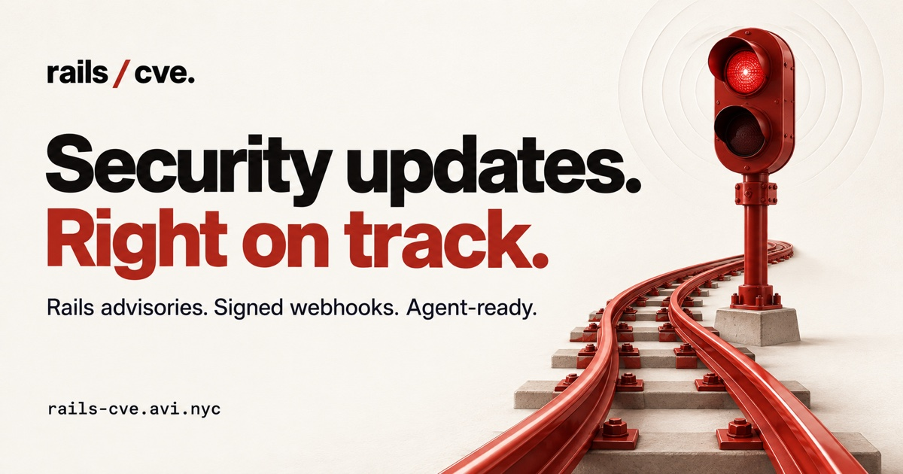
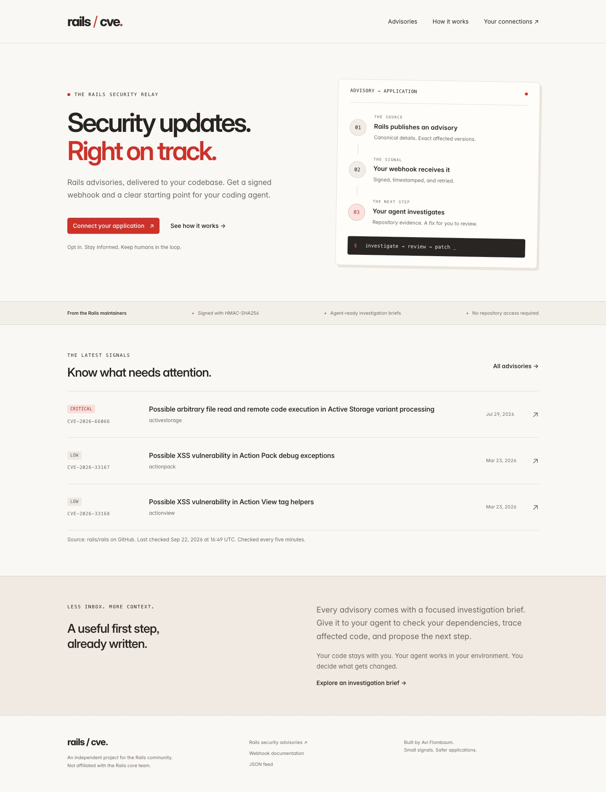
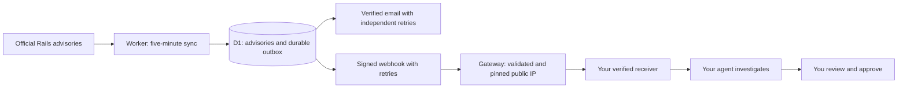

<div align="center">

<a href="https://rails-cve.avi.nyc">
  
</a>

<br />

# Rails CVE

**From a Rails security advisory to your next actionable step.**

Signed webhooks. Verified email notifications. Investigation briefs for your coding agent.

[](LICENSE)
[](https://developers.cloudflare.com/workers/)
[](tsconfig.json)
[](https://bun.sh/)
[](https://github.com/aviflombaum/rails-cve/actions/workflows/ci.yml)
[](CONTRIBUTING.md)

[**View source ↗**](https://github.com/aviflombaum/rails-cve) · [**Try it live ↗**](https://rails-cve.avi.nyc) · [**See a real payload**](https://rails-cve.avi.nyc/docs#example-payload) · [**Run locally**](#run-locally) · [**Self-host**](docs/self-hosting.md) · [**Deploy with your agent**](docs/deploy-with-agent.md) · [**Contribute**](CONTRIBUTING.md)

[](https://deploy.workers.cloudflare.com/?url=https://github.com/aviflombaum/rails-cve)

[**Deployment setup guide**](https://github.com/aviflombaum/rails-cve/blob/main/docs/deploy-with-agent.md) · [**Copy a deployment prompt for your agent**](docs/deploy-with-agent.md#copy-this-prompt-to-your-agent)

</div>

---

## The idea

A security advisory shouldn't have to sit in an inbox before someone starts investigating.

Rails CVE watches the Rails maintainers' published advisories, sends a signed notification to your application's webhook, and includes a focused prompt your agent can use inside the repository. It gives you the source, affected versions, and a useful starting point. You review what happens next.

**Your code stays with you.** The relay doesn't need access to your repositories, an LLM API key, or a subscribed mailbox.

## What you get

| | |
| :--- | :--- |
| **Canonical advisories** | Polls `rails/rails` every five minutes; preserves upstream version ranges and source links. |
| **Signed deliveries** | HMAC-SHA256 signatures, timestamps, an ownership handshake, and encrypted signing secrets. |
| **Durable retries** | D1-backed outbox, stable event IDs, recovery after interrupted attempts, and delivery history. |
| **Agent-ready context** | Copyable investigation briefs and downloadable `SKILL.md` files. Human review before changes. |
| **Your app subscriptions** | Up to ten codebases, each with webhook, email, or both. Verified destinations, tests, pause/resume, and a filterable delivery log. |
| **Account settings** | GitHub App login or management-token access, explicit account linking, recovery-token rotation, and verified notification addresses. |
| **Agent setup guides** | Copy/paste prompts for OpenClaw and NousResearch Hermes; signature-verifying receiver recipes and self-hosting instructions. |
| **Open interfaces** | Public JSON feed, per-advisory API, health endpoint, and a Rails receiver example. |
| **Self-hostable** | One Worker, D1, static assets and cron; a separate pinned-IP gateway for webhooks. |

<details>
<summary><strong>Take a look at the application</strong></summary>

<br />



</details>

## Connect your agent

[OpenClaw setup →](docs/integrations/openclaw.md) · [Hermes setup →](docs/integrations/hermes.md)

Each guide includes a prompt to give your existing agent. It builds a receiver that verifies signatures, persists events, handles the ownership handshake, and dispatches a read-only investigation to your local gateway. These are integration recipes, not bundled adapters. Keep code changes and deployment behind human approval.

[GitHub App setup →](docs/integrations/github-app.md) · [SMTP / email setup →](docs/integrations/email.md)

GitHub login and email delivery appear only when their deployment settings are configured. No credentials are included in this repository. The hosted service includes these features; self-hosted instances enable them with their own credentials.

## Deploy your own

Use the **Deploy to Cloudflare** button above or hand the [deployment prompt](docs/deploy-with-agent.md#copy-this-prompt-to-your-agent) to your agent. The guided setup requires your Cloudflare account, two independent secrets, and your final HTTPS `APP_URL`. Set the deploy command to **`bun run deploy:cloudflare`**; the standard deploy command uses a private operator config. Follow the [complete setup steps](docs/deploy-with-agent.md) before the first build. GitHub login and email are optional. Webhook delivery requires the [egress gateway](docs/egress.md), which the Cloudflare button does not provision.

## Run locally

You'll need **Bun 1.3.14+** and **Node.js 22+** (CI uses Node 24). Wrangler is installed with the project. You do **not** need a Cloudflare account for local development or tests.

Clone the public repository (or your fork):

```sh
git clone https://github.com/aviflombaum/rails-cve.git
cd rails-cve
bun install --frozen-lockfile
bun run setup
bun run db:local
bun run dev
```

Open **http://localhost:8787**. In another terminal, import the current Rails advisories:

```sh
curl --fail http://localhost:8787/cdn-cgi/local/scheduled
```

That command calls the real public GitHub advisory API and writes only to local D1. The first successful import is a **quiet baseline**: it won't notify subscribers about the entire archive. Subsequent new or changed advisories produce events.

`bun run setup` creates independent local secrets in a gitignored `.dev.vars` file. It never overwrites an existing file. Local cron events must be triggered manually; deployed cron runs every five minutes.

### Make a connection

First configure the [webhook egress gateway](docs/egress.md). Without it the local site and advisory feed work, but webhook verification and delivery are disabled.

1. Create a workspace and save its management token in your password manager.
2. Add a public HTTPS webhook URL and save the one-time signing secret.
3. Install a receiver that validates signatures and echoes verification challenges.
4. Click **Verify endpoint**, then **Send test**.
5. Hand a received investigation brief to your agent from inside the appropriate repository.

Start with the [Rails receiver example](public/receiver.rb) and [webhook integration guide](docs/webhooks.md). Localhost receivers are deliberately rejected; use a public HTTPS development endpoint you control to exercise delivery.

## What arrives?

A versioned JSON event with the complete advisory and an investigation brief:

```json
{
  "schema_version": 1,
  "id": "evt_…",
  "type": "advisory.published",
  "created_at": "2026-07-29T18:00:00.000Z",
  "advisory": {
    "id": "GHSA-xr9x-r78c-5hrm",
    "cve": "CVE-2026-66066",
    "severity": "critical",
    "packages": [
      { "name": "activestorage", "affected": "< 7.2.3.2", "patched": "7.2.3.2" }
    ]
  },
  "investigation": {
    "prompt": "Read the canonical advisory, inspect Gemfile.lock, establish applicability…",
    "skill_url": "https://rails-cve.avi.nyc/advisories/GHSA-xr9x-r78c-5hrm/SKILL.md"
  }
}
```

**Abbreviated example:** fields, additional version ranges, and long text are omitted here; the event ID and delivery time are illustrative. [Inspect or download the complete example](https://rails-cve.avi.nyc/docs#example-payload).

The prompt asks for evidence, an applicability verdict, and a proposed fix. Receiving an advisory does **not** mean your application is affected, and it does **not** start an agent or modify code automatically.

## How it fits together



The same Worker serves the website and API. D1 records advisory revisions and outgoing events atomically. A scheduled delivery runner leases pending rows, signs the exact JSON bytes, and records the result. An optional incoming-email handler can request a canonical sync; email content never becomes trusted advisory data.

[Architecture and code map →](docs/architecture.md)

## Development

```sh
bun run check       # Formatting, generated types, TypeScript, runtime tests
bun run test        # Cloudflare Workers tests with local D1 and mocked network
bun run format      # Format application, scripts, and test code
bunx wrangler deploy --dry-run  # Build/package locally; does not publish
```

CI runs these checks on pull requests and pushes to `main` without production credentials. The badge shows the live [GitHub Actions status](https://github.com/aviflombaum/rails-cve/actions/workflows/ci.yml).

| Documentation | What you'll find |
| :--- | :--- |
| [Agent-led deployment / Cloudflare button](docs/deploy-with-agent.md) | Live Cloudflare deploy button, required setup, and a copy/paste agent brief. |
| [GitHub App](docs/integrations/github-app.md) | Login registration, callback URLs, minimal permissions, and the future issue bot. |
| [Email](docs/integrations/email.md) | Configurable SMTP or Cloudflare transport and verified per-app destinations. |
| [Account and delivery workflow](docs/accounts.md) | Settings, GitHub linking, email confirmation, and delivery history. |
| [Self-hosting](docs/self-hosting.md) | Your own Cloudflare account, database, secrets, domain, and deployment. |
| [Webhook integration](docs/webhooks.md) | Signature verification, handshake, event schema, idempotency, and Rails setup. |
| [Architecture](docs/architecture.md) | Source ingestion, delivery state, and where to change things. |
| [Operations](docs/operations.md) | Monitoring, retries, capacity, security boundaries, and optional email. |
| [Contributing](CONTRIBUTING.md) | Local workflow, testing expectations, and pull requests. |
| [Security policy](SECURITY.md) | Private vulnerability reporting and supported versions. |
| [Roadmap](docs/plans/002-follow-up.md) | Concrete follow-up work and larger integration ideas. |

## Scope and next steps

V1 covers the **published `rails/rails` advisory feed**, not every Ruby gem or every historical Rails CVE. Delivery is at least once, without ordering guarantees or a delivery-time SLA. Automatic retention, global signup quotas, and seamless signing-key rotation aren't implemented yet. Save a recovery token or link GitHub before losing access. The [operations guide](docs/operations.md) documents these limits and the required gateway boundary.

A future **GitHub App** could open or update one issue per advisory in opted-in repositories, including the context and agent prompt. That would let teams use their existing issue-to-agent workflow without building a receiver. **GitHub login ships in this branch; repository installation and issue delivery remain planned.**

Contributions to reliability, accessibility, documentation, and receiver examples are welcome. For large integrations, start with a proposal so we can agree on scope.

## Credits and license

Built by [Avi Flombaum](https://avi.nyc). Inspired by the idea of bringing Rails security notifications directly into the codebases that need them, and by the Rails team's [CVE-specific forensic skills](https://github.com/rails/rails-forensics-CVE-2026-66066).

**[MIT licensed](LICENSE).** Inter retains its SIL Open Font License; advisory snapshots and other upstream material retain their respective terms. See [third-party notices](THIRD_PARTY_NOTICES.md).

An independent community project. Not affiliated with or endorsed by the Rails core team.
