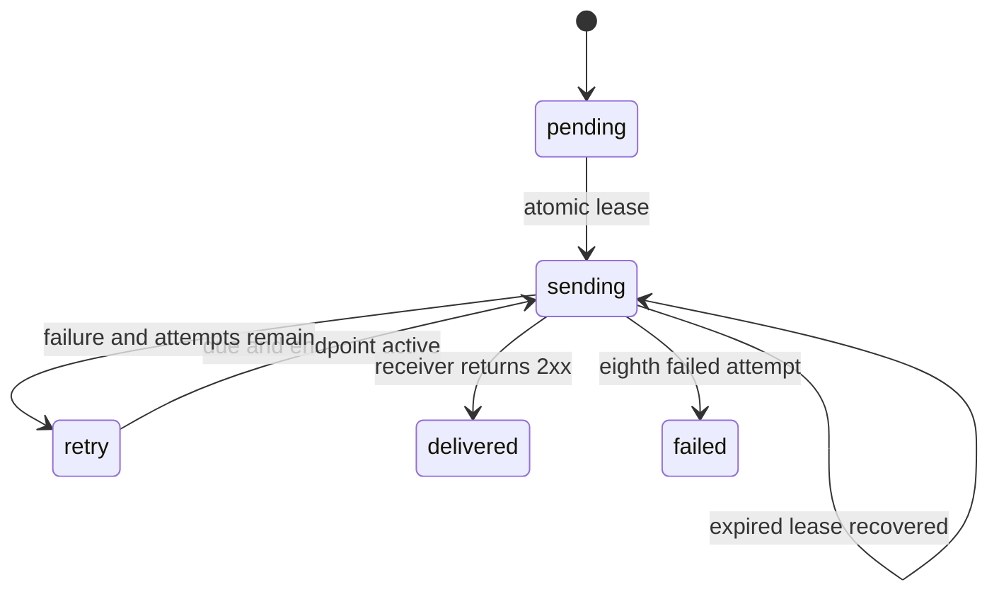

# Architecture

Rails CVE is a server-rendered Hono application on Cloudflare Workers. The same module exports HTTP, scheduled, and incoming-email handlers. Static assets are served through a Worker binding; D1 holds application state and the durable delivery outbox.

## Code map

| Path | Responsibility |
| --- | --- |
| `src/index.tsx` | Routes, authentication, origin/rate-limit checks, handler entry points. |
| `src/views.tsx` | Server-rendered pages and social metadata. |
| `src/advisories.ts` | Upstream validation, normalization, prompts, payload construction, ingestion and sync. |
| `src/delivery.ts` | Destination dispatch, test events, leases, attempt recording and retries. |
| `src/security.ts` | Tokens, hashing, HMAC, encryption, URL/DNS checks and bounded reads. |
| `src/examples.ts` | Illustrative event generated from a frozen upstream snapshot. |
| `migrations/` | D1 schema history. |
| `public/` | CSS, small client-side clipboard script, artwork, font and receiver example. |
| `test/core.test.ts` | Workers-runtime regression tests with D1 and mocked network. |
| `scripts/setup.ts` | Creates local development secrets without overwriting existing keys. |

`APP_URL` is the configured site origin. Request-scoped Hono context supplies it to rendered canonical/social links; delivery and example links use it as well. There is no mutable global request state.

## Source ingestion

1. Acquire a bounded D1 sync lease.
2. Fetch the published advisory pages from the fixed `rails/rails` GitHub endpoint.
3. Validate and normalize all fetched data before beginning ingestion.
4. Compare each record with its stored snapshot; hash the normalized revision.
5. Atomically persist that advisory, its immutable event, and deliveries for currently active endpoints.
6. Record sync success, then release the lease.

The initial import creates a baseline only. Later revisions use deterministic IDs and uniqueness constraints. Unchanged data creates no new events. Missing records in a response are not interpreted as withdrawals. A failed fetch preserves prior data and marks source health degraded.

The optional email handler requests the same canonical sync; it does not parse email bodies into advisory facts. Polling remains the reconciliation path.

## Delivery lifecycle

Each invocation drains at most 25 due records, five concurrently. Two-minute leases recover interrupted work. A receiver may accept a request before the runner records success, so duplicate delivery is possible and expected. Receivers must persist/deduplicate event IDs.

D1's outbox avoids losing an event between database commit and queue publication. A future queue can accelerate processing while retaining a reconciler over this durable state. The current implementation needs no Cloudflare Queue.

## Ownership and credentials

A workspace is identified by a random 256-bit management capability. D1 stores only its SHA-256 hash. Browsers use an HttpOnly, SameSite=Strict cookie, marked Secure on HTTPS. POSTs enforce same-origin checks unless using an Authorization header; private routes still authenticate the supplied credential. Writes are rate-limited per IP.

Each connection has an independently generated signing secret, AES-GCM-encrypted using a Worker secret. A signed challenge proves endpoint control before activation. Destination validation, timeouts, and redirect rejection apply on every attempt.

Read [SECURITY.md](../SECURITY.md) and [operations](operations.md) for limitations, especially DNS resolution races, key rotation, and recovery. The service never reads subscriber repositories or runs subscriber agents.

## Database tables

| Table | Purpose |
| --- | --- |
| `accounts` | Workspace identity and management-token hash. |
| `endpoints` | Tenant-owned destinations, encrypted secrets, status and challenge. |
| `advisories` | Latest normalized upstream snapshots. |
| `events` | Immutable revision payloads and explicit test events. |
| `deliveries` | One endpoint/event pair, status, attempts, lease and last result. |
| `state` | Baseline marker, sync lease and source health. |

Deleting a connection removes its secret and delivery history. Current historical advisory/event records have no automatic retention policy. Database evolution uses additive numbered migrations; deployments must account for data and code compatibility separately.
