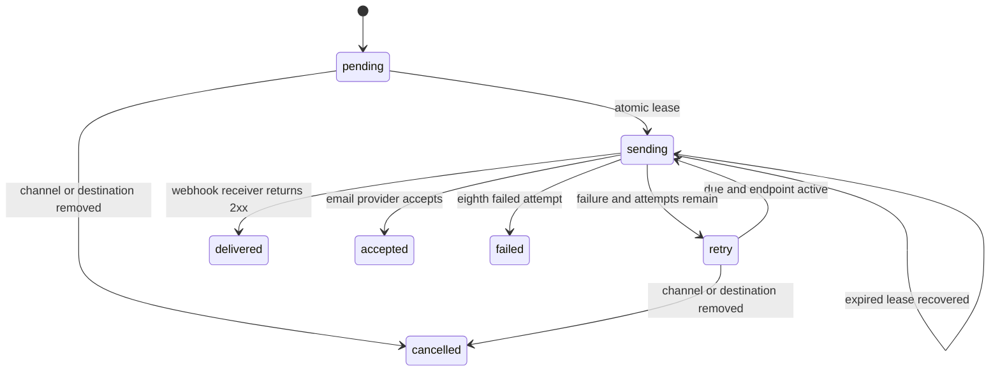

# Architecture

Rails CVE is a server-rendered Hono application on Cloudflare Workers. The same module exports HTTP, scheduled, and incoming-email handlers. Static assets are served through a Worker binding; D1 holds application state and the durable delivery outbox.

## Code map

| Path | Responsibility |
| --- | --- |
| `src/index.tsx` | Routes, authentication, origin/rate-limit checks, handler entry points. |
| `src/views.tsx`, `src/workspace-views.tsx`, `src/docs-views.tsx` | Public pages, social metadata, settings, subscriptions, history and the site documentation. |
| `src/auth.ts`, `src/oauth.ts`, `src/workspace.tsx` | Sessions, GitHub identity flow and tenant-scoped settings/history routes. |
| `src/fanout.ts`, `src/email.ts`, `src/smtp.ts` | Channel eligibility, verified mailboxes, configurable mail transports. |
| `src/integration-content.ts`, `src/integration-views.tsx` | Public setup prompts and agent integration pages. |
| `src/advisories.ts` | Upstream validation, normalization, prompts, payload construction, ingestion and sync. |
| `src/delivery.ts` | Destination dispatch, test events, leases, attempt recording and retries. |
| `src/security.ts` | Tokens, hashing, HMAC, encryption, URL/DNS checks and bounded reads. |
| `src/examples.ts` | Illustrative event generated from a frozen upstream snapshot. |
| `migrations/` | D1 schema history. |
| `public/` | CSS, small client-side clipboard script, artwork, font and receiver example. |
| `test/core.test.ts` | Workers-runtime regression tests with D1 and mocked network. |
| `scripts/setup.ts` | Creates local development secrets without overwriting existing keys. |

`APP_URL` is the configured site origin. Request-scoped Hono context supplies it to rendered canonical/social links; delivery and example links use it as well. There is no mutable global request state.

## Source ingestion

1. Acquire a bounded D1 sync lease.
2. Fetch the published advisory pages from the fixed `rails/rails` GitHub endpoint.
3. Validate and normalize all fetched data before beginning ingestion.
4. Compare each record with its stored snapshot; hash the normalized revision.
5. Atomically persist that advisory, its immutable event, and deliveries for currently active endpoints.
6. Record sync success, then release the lease.

The initial import creates a baseline only. Later revisions use deterministic IDs and uniqueness constraints. Unchanged data creates no new events. Missing records in a response are not interpreted as withdrawals. A failed fetch preserves prior data and marks source health degraded.

The optional email handler requests the same canonical sync; it does not parse email bodies into advisory facts. Polling remains the reconciliation path.

`src/github-polling.ts` optionally authenticates this fixed feed with an explicit
operator token or a fresh metadata-only GitHub App installation token for each
sync. App keys stay in Worker secrets and issued tokens stay in invocation memory.
Partial configuration and failed token exchanges fail closed without changing
stored advisories. See [authenticated polling](integrations/github-polling.md).

## Delivery lifecycle

Each invocation drains at most 25 due records, five concurrently. Two-minute leases recover interrupted work. A receiver may accept a request before the runner records success, so duplicate delivery is possible and expected. Receivers must persist/deduplicate event IDs.

D1's outbox avoids losing an event between database commit and queue publication. A future queue can accelerate processing while retaining a reconciler over this durable state. The current implementation needs no Cloudflare Queue.

## Ownership and credentials

Existing workspaces retain their random 256-bit management capability, stored as a SHA-256 hash. GitHub App sign-in identifies a user by their stable numeric GitHub ID, never email matching. Linking must start and finish in the same authenticated workspace. Single-use ten-minute state is bound to a separate browser cookie; PKCE protects the code exchange. Provider tokens are used once for `/user`, then discarded.

New browser logins create independently hashed, expiring 30-day session tokens, revoked on logout. Cookies are HttpOnly, SameSite=Lax (required for the cross-site GitHub callback) and Secure on HTTPS. POSTs enforce same-origin checks or require explicit Authorization authentication on private routes; invalid Authorization never falls back to the cookie. Legacy capability cookies and bearer tokens remain compatible. Settings requires the current management capability or fresh linked-GitHub proof to replace a token, revoke old sessions and OAuth flows, and optionally remove an identity link. Authentication generations prevent stale callbacks or session issuance from restoring access after recovery.

Notification mailboxes have hashed, expiring confirmation tokens. GET renders a confirmation form; authenticated POST consumes the token for the requesting account. Verification never changes login identity. Per-destination cooldown and per-account caps bound verification abuse.

Each connection has an independently generated signing secret and a complete destination URL, both AES-GCM-encrypted using a Worker secret. The UI masks destination paths and queries; legacy URL rows are upgraded in bounded scheduled/admin batches. A signed challenge proves endpoint control before activation. Destination validation, timeouts, and redirect rejection apply on every attempt.

Read [SECURITY.md](../SECURITY.md) and [operations](operations.md) for limitations, including the required [pinned-IP egress gateway](egress.md), key rotation, and recovery. The service never reads subscriber repositories or runs subscriber agents.

## Database tables

| Table | Purpose |
| --- | --- |
| `accounts` | Workspace profile, optional unique GitHub identity and management-token hash. |
| `sessions`, `oauth_states` | Expiring browser sessions and single-use browser-bound OAuth state. |
| `email_addresses`, `email_cooldowns` | Verified account-owned mailboxes and destination verification throttling. |
| `endpoints` | Historical table name for app subscriptions: channel mode, mail address, webhook URL/ownership and encrypted secret. |
| `advisories` | Latest normalized upstream snapshots. |
| `events` | Immutable revision payloads and explicit test events. |
| `deliveries` | One app/event/channel tuple, email destination identity, status, attempts, lease and last result. |
| `delivery_attempts` | Completed attempt summaries; no receiver bodies or raw provider errors. |
| `state` | Baseline marker, sync lease and source health. |

Deleting a connection removes its secret and delivery history. Current historical advisory/event records have no automatic retention policy. Database evolution uses additive numbered migrations; deployments must account for data and code compatibility separately.

## Per-app channels

`fanout()` runs inside the advisory transaction. It inserts a webhook item only for a verified webhook in webhook/both mode, and an email item only for a verified account-owned address in email/both mode. An active both-mode app can receive mail while its webhook awaits verification. Each channel leases and retries independently; success never requeues the other channel. Channel disabling or destination changes cancel queued obsolete items; in-flight requests cannot be recalled. Pausing excludes new fanout and holds queued deliveries until resume.

Email providers are selectable: SMTP via implicit TLS port 465, or Cloudflare EMAIL binding. No outbound email is enabled in the portable config. Missing/disabled mail configuration holds pending email items without burning attempts. Provider acceptance is labeled `accepted`; SMTP/Cloudflare inbox receipts are not tracked.

`/events` paginates 30 rows per page with tenant-scoped app/channel/status filters. `/events/:id` joins through the owning app before exposing immutable payloads or attempt summaries. Migration 0002 retains existing IDs, marks previously active/paused webhooks verified, rebuilds outbox uniqueness per channel and preserves legacy aggregate history.

Canonical API requests use manual redirect handling. Any non-2xx response, including a redirect, fails the sync, retains existing advisory data, and records degraded source health. Redirect targets never receive the optional GitHub token.

`src/egress.ts` sends authenticated envelopes only to the operator-configured gateway. `egress/gateway.mjs` resolves and validates destinations and pins the HTTPS socket lookup; `test/egress.test.mjs` runs offline Node boundary tests as part of `bun run check`. Missing gateway configuration disables webhook dispatch without consuming queued attempts.

`src/abuse.ts` owns D1 atomic reservation budgets, bounded retention and transaction-scoped account deletion statements. Migration 0004 adds these records without rewriting deployed migrations. Inventory admission caps bound source fanout; the runner interleaves per-tenant batches and protects live notifications from retention. Operator-only `/api/admin/health` exposes aggregate backlog and budget state separately from public source health.
